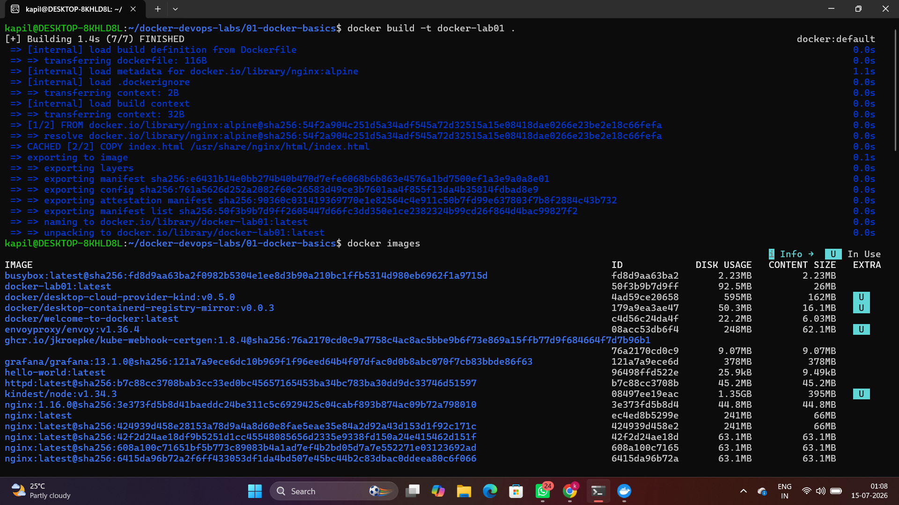
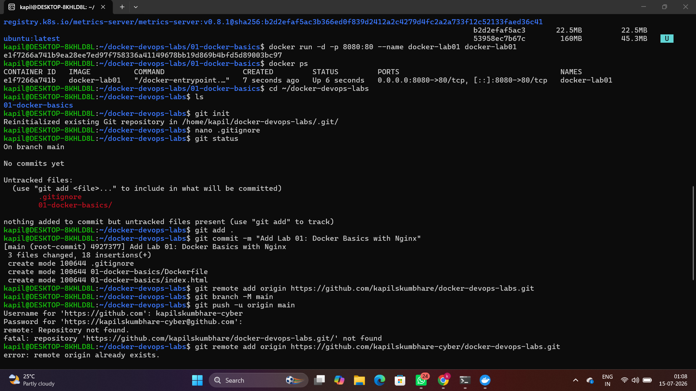
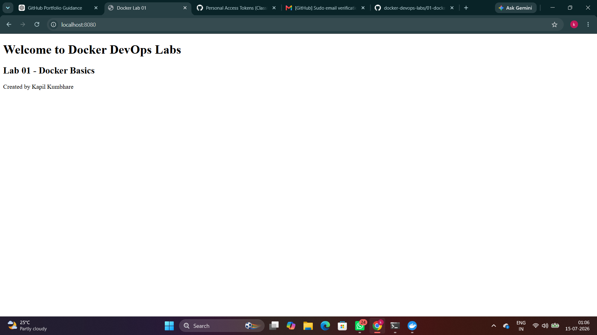

# 🐳 Lab 01 - Docker Basics with Nginx

## 📖 Overview

This lab demonstrates the basics of Docker by creating a custom Docker image using the official Nginx Alpine image. A simple HTML webpage is containerized and served using Nginx.

---

## 🎯 Objectives

- Create a Dockerfile
- Build a Docker image
- Run a Docker container
- Expose container ports
- Serve a static HTML page using Nginx

---

## 📂 Project Structure

```
01-docker-basics/
│
├── Dockerfile
├── index.html
├── README.md
├── commands.md
└── screenshots/
    ├── build_output.png
    ├── docker-ps.png
    └── browser_output.png
```

---

## 🐳 Dockerfile

```dockerfile
FROM nginx:alpine

COPY index.html /usr/share/nginx/html/index.html

EXPOSE 80
```

---

## 🚀 Steps

### 1. Build the Docker image

```bash
docker build -t docker-lab01 .
```

### 2. Verify the image

```bash
docker images
```

### 3. Run the container

```bash
docker run -d -p 8080:80 --name docker-lab01 docker-lab01
```

### 4. Verify the running container

```bash
docker ps
```

### 5. Open the application

Visit:

```
http://localhost:8080
```

---

## 📸 Output

### Build Output



### Running Container



### Browser Output



---

## 📚 Commands

See [commands.md](commands.md) for all commands used in this lab.

---

## ✅ Key Takeaways

- Built a Docker image from a Dockerfile.
- Ran a Docker container using the created image.
- Mapped container port 80 to host port 8080.
- Served a static HTML page using Nginx.
- Verified images and running containers.

---

## 👨‍💻 Author

**Kapil Kumbhare**

