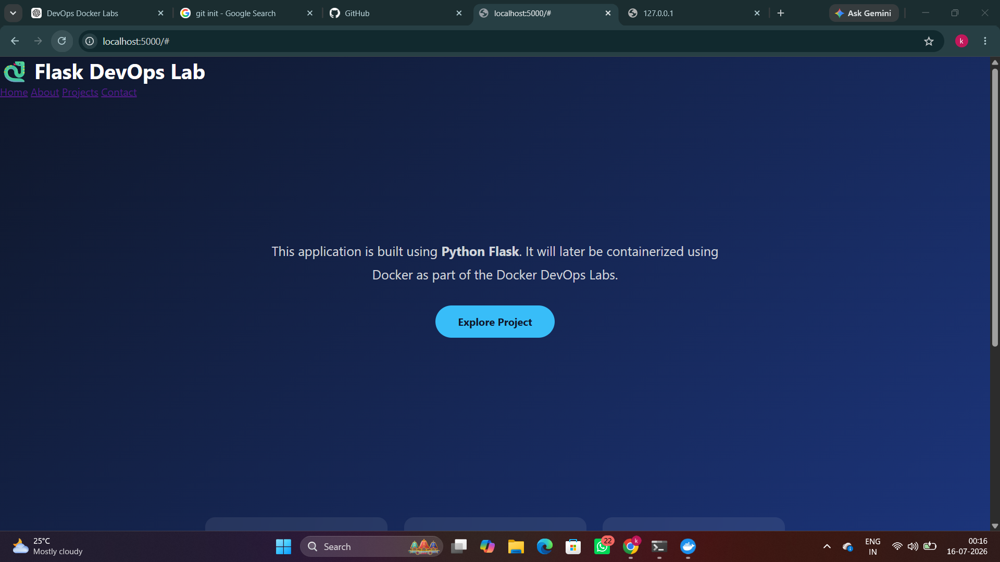
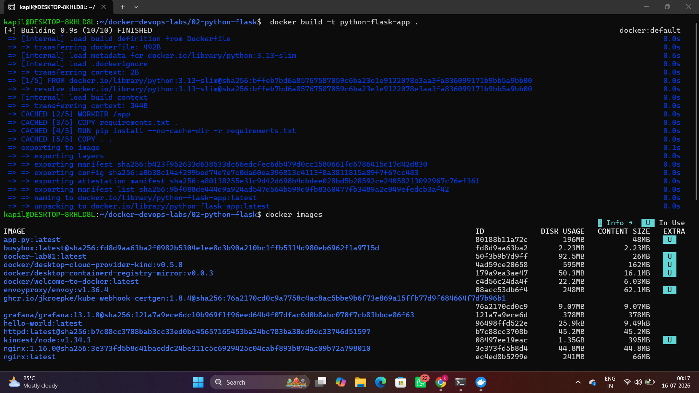
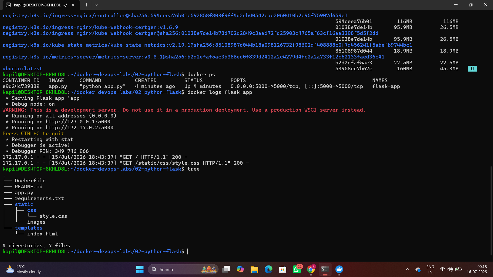

<div align="center">

# 🐍 Docker DevOps Lab 02 – Python Flask Application

Containerizing a simple Python Flask web application using Docker.



</div>

---

## 📖 Overview

This project demonstrates how to package a Python Flask application into a Docker container. The application is built using Flask, containerized with Docker, and accessed through Docker port mapping.

---

## 🎯 Objectives

- Build a simple Flask web application
- Create a Dockerfile
- Build a Docker image
- Run the application inside a container
- Understand Docker port mapping

---

## 🛠️ Tech Stack

- Python 3.13
- Flask
- Docker
- HTML5
- CSS3
- Ubuntu (WSL)

---

## 🏗️ Architecture

```text
Browser
   │
HTTP Request
   │
Docker Port Mapping
   │
Docker Container
   │
Flask Application
```

---

## 📂 Project Structure

```text
02-python-flask/
├── app.py
├── Dockerfile
├── requirements.txt
├── templates/
├── static/
├── screenshots/
└── README.md
```

---

## ⚙️ Docker Workflow

1. Created a Flask application.
2. Wrote a Dockerfile.
3. Installed dependencies using `requirements.txt`.
4. Built the Docker image.
5. Started the container.
6. Accessed the application through the browser.

---

## 📸 Screenshots

### Browser Output


### Docker Build



### Docker Inspect



---

## 📚 Key Learnings

- Flask project structure
- Docker image creation
- Docker container execution
- Dockerfile instructions
- Port mapping
- Running Flask inside Docker

---

## 🚧 Challenges

| Issue | Solution |
|--------|----------|
| Dockerfile missing | Created the Dockerfile |
| Flask inaccessible | Used `host="0.0.0.0"` |
| Network timeout | Rebuilt the image |

---

## 👨‍💻 Author

**Kapil Kumbhare**


