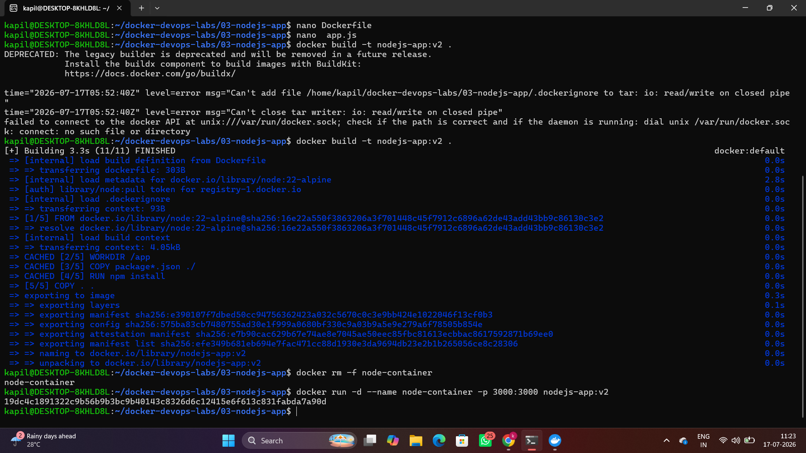
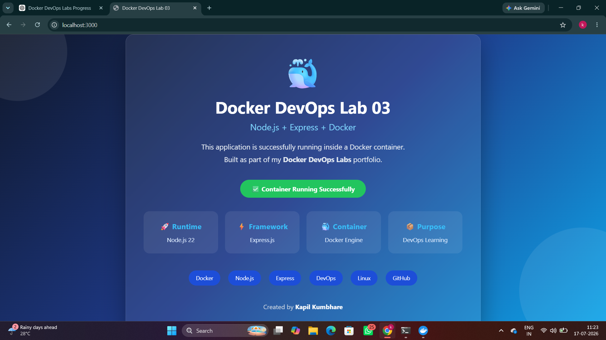

# 🐳 Lab 03 - Dockerizing a Node.js Application

This lab demonstrates how to containerize a simple Node.js application using Docker. The application is built with **Node.js** and **Express.js**, then packaged into a Docker image and executed inside a container.

---

## 📌 Objective

- Build a simple Node.js web application
- Create a Docker image using a Dockerfile
- Run the application inside a Docker container
- Access the application through a web browser

---

## 🛠️ Tech Stack

- Docker
- Node.js
- Express.js

---

## 📂 Project Structure

```text
03-nodejs-app/
├── app.js
├── Dockerfile
├── package.json
├── package-lock.json
├── .dockerignore
├── .gitignore
├── README.md
└── screenshots/
    ├── 03_build_output.png
    └── 03_browser_output.png
```

---

## 🚀 Build the Docker Image

```bash
docker build -t nodejs-app:v2 .
```

---

## ▶️ Run the Container

```bash
docker run -d --name node-container -p 3000:3000 nodejs-app:v2
```

---

## 🌐 Access the Application

Open your browser and visit:

```
http://localhost:3000
```

---

## 📸 Screenshots

### Docker Build



### Application Running



---

## 📖 Key Docker Concepts

- Docker Images
- Docker Containers
- Dockerfile
- Base Images
- Working Directory (`WORKDIR`)
- Copying Files (`COPY`)
- Installing Dependencies (`RUN`)
- Port Mapping (`EXPOSE`)
- Default Container Command (`CMD`)

---

## 📚 Commands Used

```bash
docker build -t nodejs-app:v2 .
docker run -d --name node-container -p 3000:3000 nodejs-app:v2
docker ps
docker images
docker logs node-container
```

---

## 🎯 Learning Outcome

After completing this lab, you will be able to:

- Build Docker images for Node.js applications
- Run applications inside Docker containers
- Expose container ports to the host
- Verify container status using Docker commands
- Understand the basic Docker workflow from source code to a running container

---

## 👨‍💻 Author

**Kapil Kumbhare**
Devops


