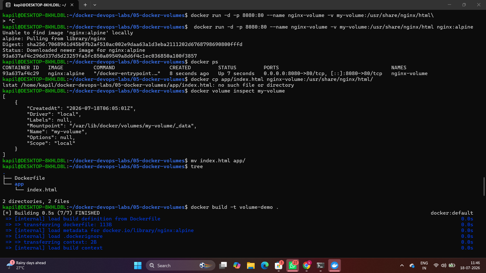
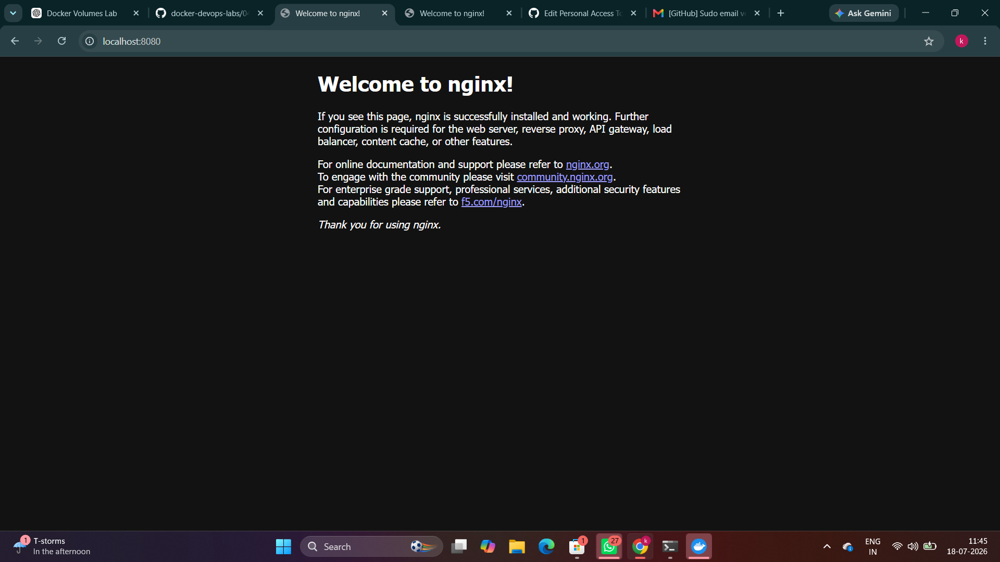

# 📦 Lab 05 – Docker Volumes

A hands-on project demonstrating **Docker Volumes** and **persistent storage** in Docker. This lab shows how data remains available even after a container is removed and recreated by using a named Docker volume.

---

## 🚀 Technologies Used

- Docker
- Nginx (Alpine)
- HTML
- Ubuntu (WSL)

---

## 📁 Project Structure

```text
05-docker-volumes/
├── app/
│   └── index.html
├── screenshots/
│   ├── 05_build_volume.png
│   └── 05_browser_output.png
├── Dockerfile
└── README.md
```

---

## ⚙️ Dockerfile

```dockerfile
FROM nginx:alpine

COPY app/ /usr/share/nginx/html/

EXPOSE 80
```

---

## ▶️ Getting Started

### Build the Docker Image

```bash
docker build -t volume-demo .
```

### Create a Docker Volume

```bash
docker volume create my-volume
```

### Run the Container

```bash
docker run -d \
--name nginx-volume \
-p 8080:80 \
-v my-volume:/usr/share/nginx/html \
nginx:alpine
```

Open your browser:

```
http://localhost:8080
```

---

## 📸 Screenshots

### Build Output



### Browser Output



---

## 🎯 Key Learnings

- Built a Docker image using Nginx.
- Created and managed a Docker Volume.
- Mounted a named volume into a container.
- Understood the difference between container storage and persistent storage.
- Verified data persistence across container recreation.

---

## 👨‍💻 Author

**Kapil Kumbhare**  

