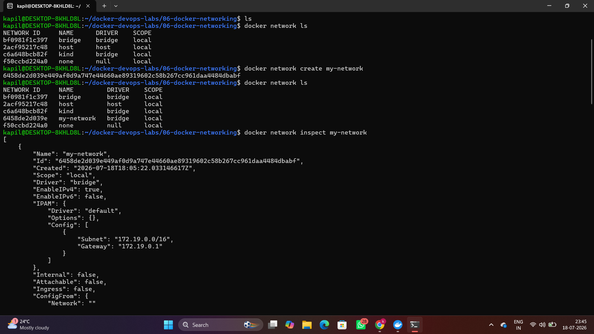
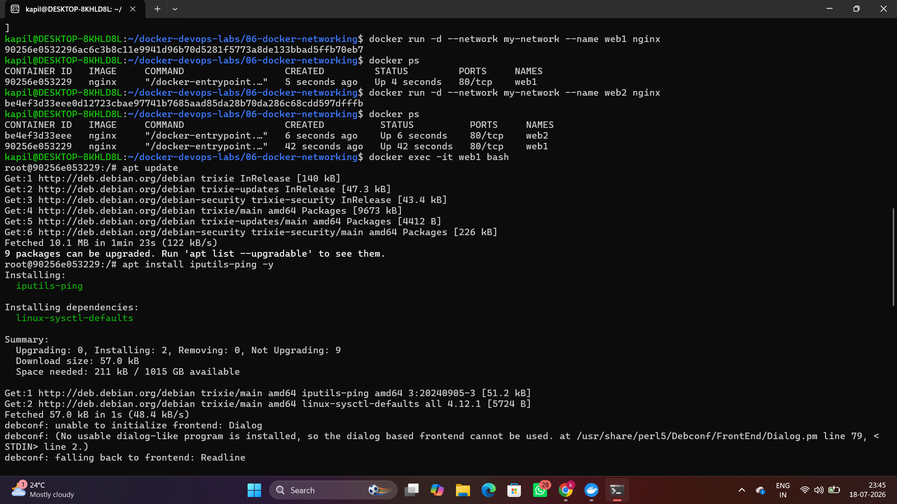

# Lab 06 - Docker Networking

## 📌 Objective

The objective of this lab is to understand how Docker networking enables communication between containers. In this lab, a custom bridge network was created, multiple containers were connected to it, and container-to-container communication was tested using Docker's built-in DNS.

---

## 🛠️ Technologies Used

- Docker
- Docker Network
- Nginx
- Linux (Ubuntu WSL)

---

## 📂 Project Structure

```
06-docker-networking/
│
├── screenshots/
│   ├── 06_create_network.png
│   ├── 06_attach_to_container.png
│   ├── 06_internal_dns_and_connection.png
│
├── README.md
├── commands.md
└── interview-questions.md
```

---

## 🚀 Tasks Performed

- Created a custom Docker bridge network.
- Verified the created network.
- Inspected network configuration.
- Launched two Nginx containers on the same network.
- Verified running containers.
- Accessed a container using Docker Exec.
- Installed the ping utility.
- Tested communication between containers.
- Verified container IP address.
- Disconnected and reconnected a container to the network.
- Removed containers and deleted the custom network.

---

## 📸 Screenshots

### Create Custom Network



---

### Attach Containers to Custom Network



---

### Internal DNS & Container Communication


---

## 📚 Concepts Learned

- Docker Networks
- Bridge Network
- Custom Bridge Network
- Docker DNS
- Container-to-Container Communication
- Docker Network Inspect
- Network Connect & Disconnect
- Docker Network Cleanup

---

## ✅ Outcome

Successfully created and managed a custom Docker bridge network. Verified communication between containers using Docker's internal DNS and learned how Docker networking enables isolated and secure container communication.
